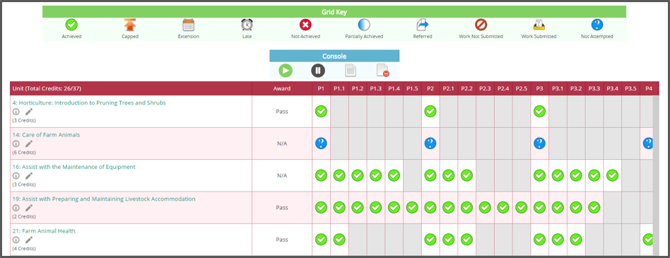
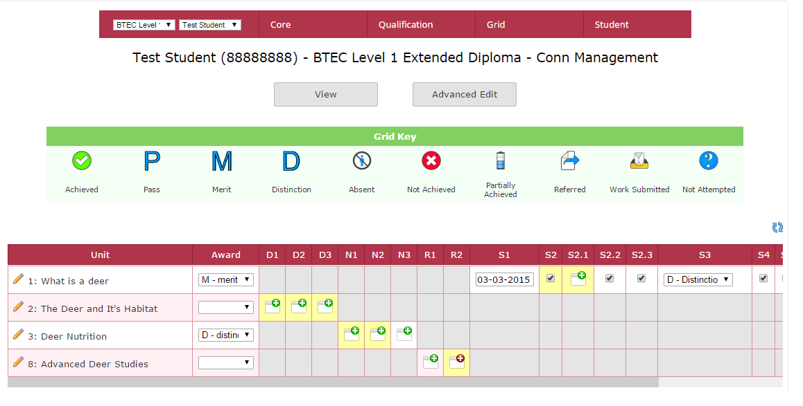
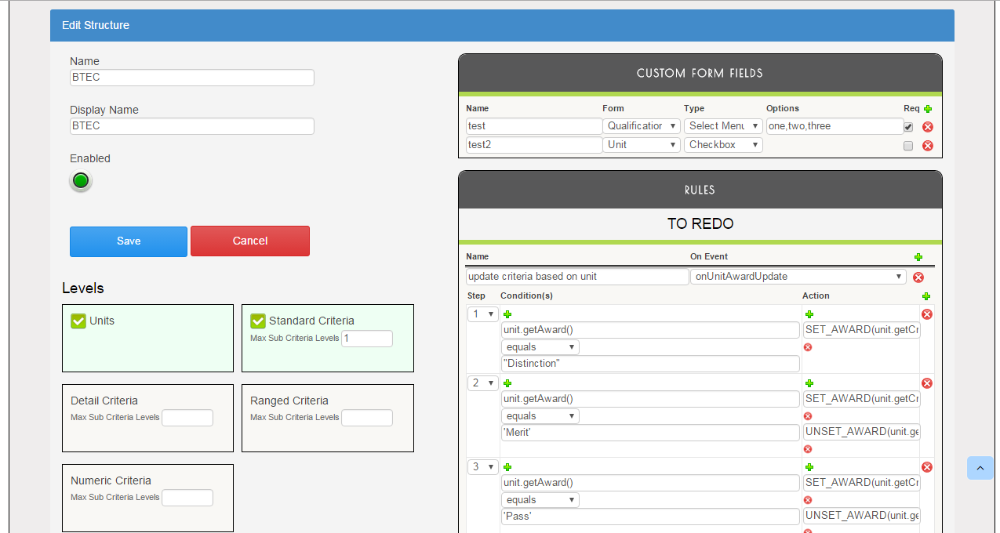
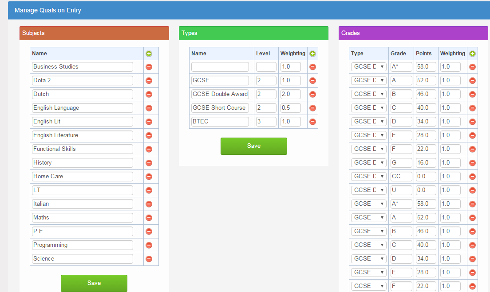
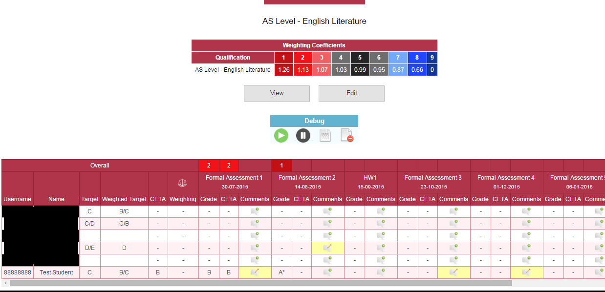
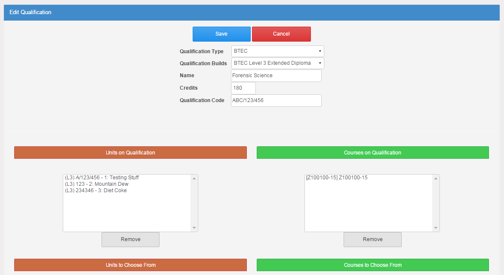
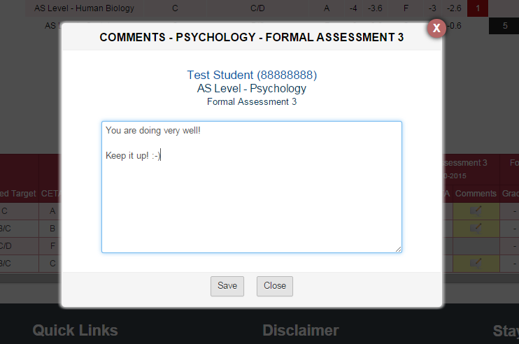
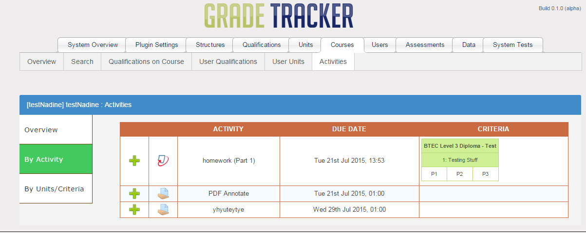
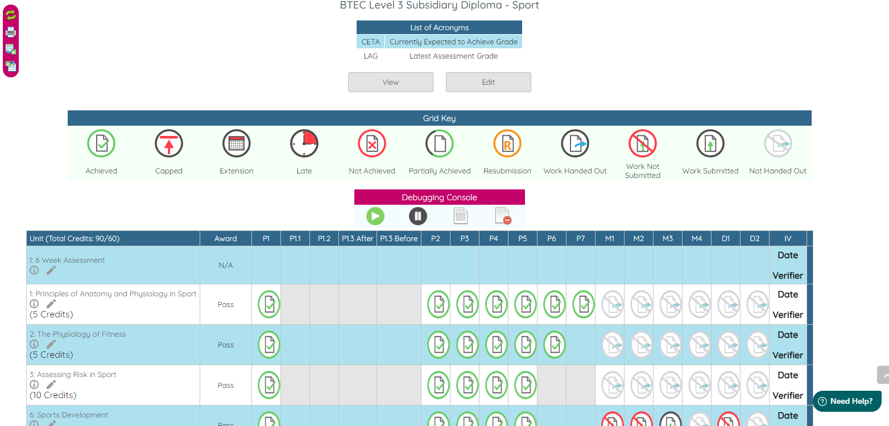

# Grade Tracker Plugin (v2.0.0)

This plugin provides you with the Grade Tracker block, which can be used to track students' progress across a wide range of qualification types, from qualification level, down to criteria level.

Features
------------
- Bespoke Qualifications - Build your own qualification structures to suit your needs
- Pre-Defined Qualification Structures - 15+ Qualification structures available for download on the demo site, such as BTEC, City & Guilds, City & Guilds NVQ/VRQ, A Level, CACHE, Access, etc...)
- Integration with Moodle activities - Link your Moodle assignments and Turnitin assignments to Grade Tracker units/criteria for automated grid updates on submission/late submission/no submission
- Offline Marking - Download any grid as an Excel spreadsheet, do your marking offline and then import it back into the system
- Reporting - Build your own custom reports using the Reporting Dashboard block, or choose from the pre-built reports which come with the Grade Tracker
- Customisable - Alter numerous settings to customise the Grade Tracker in a way which works best for you

User Guide
------------
There is a PDF [User Guide](docs/GT%20User%20Guide.pdf) included with the plugin code. This can be found in the */docs/* directory.
Additionally, there may be extra pieces of information on the [Wiki](https://github.com/cwarwicker/moodle-block_gradetracker/wiki)

Screenshots
------------
Viewing a Student's Grid:

Editing a Student's Grid:

Qualification Structure Configuration:

Quals on Entry Configuration:

Assessment Style Qualification Grid (A Level example):

Qualification Configuration:

Adding a Comment to a Student's Criteria/Assessment:

Linking Units and Criteria to Moodle Assignments:

Example of a Customised System with different options and icons:

Requirements
------------
- Moodle 3.4, 3.5, 3.6, 3.7
- Plugin block_bc_dashboard installed
- Plugin local_df_hub installed

Installation
------------
1. Download the latest version of the plugin from the [Releases](https://github.com/cwarwicker/moodle-block_gradetracker/releases) page.
2. Extract the directory from the zip file and rename it to 'gradetracker' if it is not already named as such.
3. Place the 'gradetracker' folder into your Moodle site's */blocks/* directory.
4. Run the Moodle upgrade process either through the web interface or command line.
5. Add the block to a page and start using it

License
-------
https://www.gnu.org/licenses/gpl-3.0

Support
-------
If you need any help using the block, or wish to report a bug or feature request, please use the issue tracking system: https://github.com/cwarwicker/moodle-block_gradetracker/issues

If you want to help out with the development, feel free to submit commits for review.